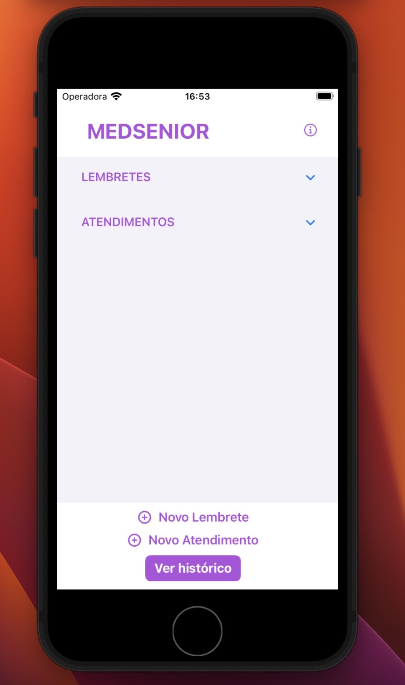
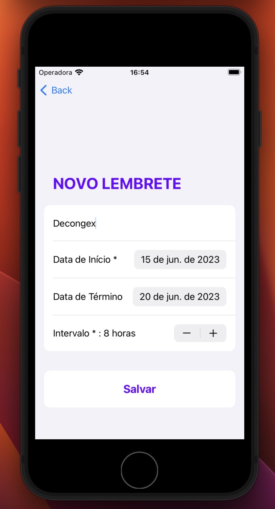
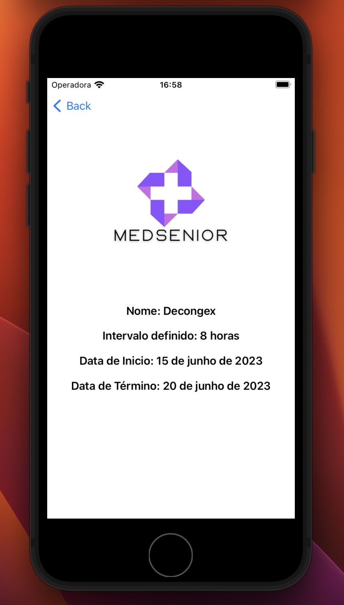
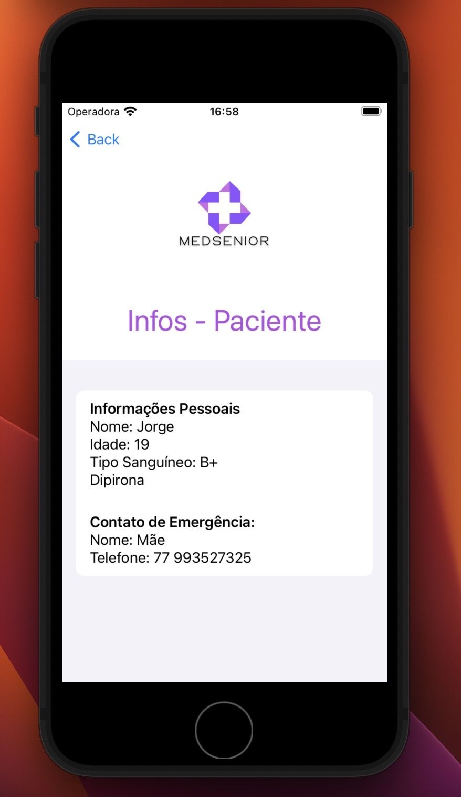

# 🩺 MedSenior App

Aplicativo desenvolvido como **projeto final apresentado durante o HackaTruck MakerSpace (Instituto Eldorado & IBM)**.

O objetivo do projeto é organizar informações relacionadas à saúde do usuário, permitindo o gerenciamento de atendimentos e lembretes por meio de uma interface intuitiva desenvolvida com SwiftUI.

---

## 🚀 Funcionalidades

* Cadastro de atendimentos
* Cadastro de lembretes
* Visualização de histórico
* Navegação entre telas
* Interface simples e intuitiva

---

## 🛠️ Tecnologias utilizadas

* Swift
* SwiftUI
* Xcode

---

## 📸 Demonstração

---

## ▶️ Como executar

1. Abra o projeto no Xcode
2. Execute em um simulador iOS ou dispositivo físico

---

## 💡 Contexto

Este projeto foi desenvolvido como entrega final do HackaTruck, representando a aplicação prática dos conhecimentos adquiridos durante o programa.
