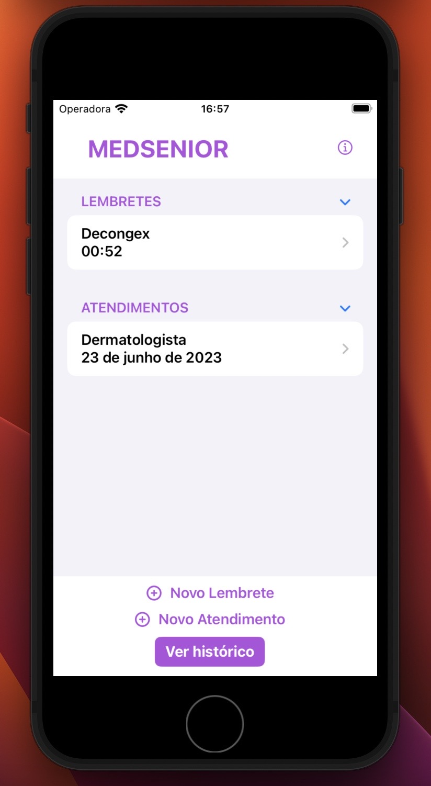
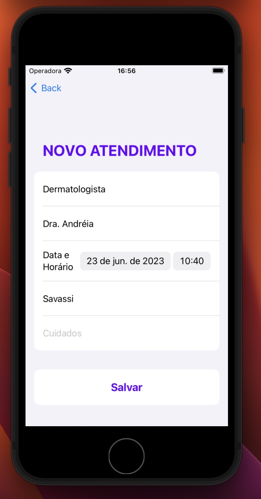
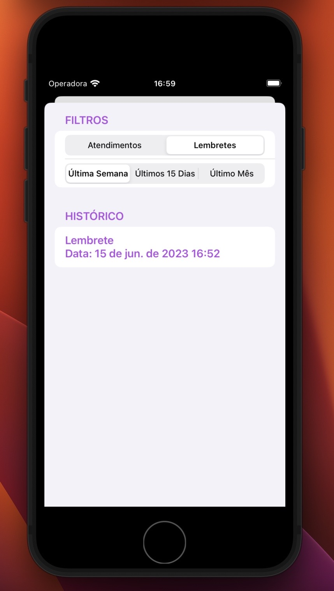
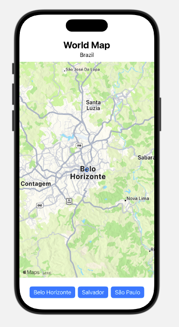
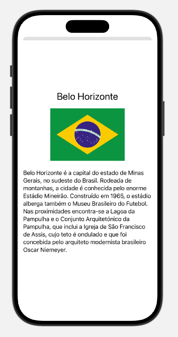

# 📱 HackaTruck iOS Apps 2023

Este repositório reúne os principais projetos desenvolvidos durante minha participação no **HackaTruck MakerSpace (Instituto Eldorado & IBM)**, um programa intensivo de capacitação tecnológica com foco em desenvolvimento iOS, computação em nuvem, APIs e soluções inovadoras.

Durante o programa, desenvolvi aplicações utilizando **Swift** e **SwiftUI**, explorando conceitos fundamentais de desenvolvimento mobile, integração com serviços externos e construção de interfaces modernas.

---

## 🚀 Sobre o HackaTruck

O HackaTruck é um projeto educacional que percorre universidades do Brasil promovendo:

* Desenvolvimento de aplicações iOS com Swift
* Integração com APIs e serviços em nuvem
* Uso de Inteligência Artificial com IBM Watson
* Cultura maker e inovação tecnológica

---

## 📂 Projetos incluídos

### 🩺 MedSenior App

Aplicativo desenvolvido como **projeto final apresentado durante o HackaTruck MakerSpace (Instituto Eldorado & IBM)**, com foco na organização de informações na área da saúde e construção de uma interface funcional utilizando SwiftUI.

**Principais funcionalidades:**

* Navegação entre telas
* Cadastro de atendimentos e lembretes
* Visualização de histórico
* Interface intuitiva e estruturada

**Tecnologias:**

* Swift
* SwiftUI
* Xcode

📁 Caminho: `/MedSenior/`

---

### 🗺️ Maps City App

Aplicativo desenvolvido como parte das atividades práticas do HackaTruck, com o objetivo de **explorar o uso do MapKit e interação com mapas em aplicações iOS**.

**Principais funcionalidades:**

* Exibição de mapa interativo
* Anotações clicáveis (MapAnnotation)
* Exibição de detalhes das cidades em modal (sheet)
* Estrutura de dados personalizada

**Tecnologias:**

* Swift
* SwiftUI
* MapKit

📁 Caminho: `/MapsApp/`

---

### ⚡ Harry Potter Characters App

Aplicativo desenvolvido para fins de aprendizado durante o HackaTruck, com foco em **consumo de API REST, manipulação de dados e exibição dinâmica de informações em aplicações iOS**.

**Principais funcionalidades:**

* Consumo de API REST
* Listagem dinâmica de personagens
* Navegação para tela de detalhes
* Carregamento de imagens com AsyncImage

**Tecnologias:**

* Swift
* SwiftUI
* URLSession
* JSON / Codable

📁 Caminho: `/HarryPotterApp/`

---

## 🛠️ Tecnologias utilizadas

* Swift
* SwiftUI
* Xcode
* MapKit
* Consumo de APIs REST
* JSON / Codable
* AsyncImage

---

## 📸 Demonstração dos Aplicativos

### 🩺 MedSenior





---

### 🗺️ Maps App





---

### ⚡ Harry Potter App


---

## ▶️ Como executar

1. Clone este repositório:

```bash
git clone https://github.com/inaciooow/HackaTruck-IOS-Apps-2023.git
```

2. Abra o projeto desejado no Xcode:

* `/MedSenior/`
* `/MapsApp/`
* `/HarryPotterApp/`

3. Execute em um simulador iOS ou dispositivo físico.

---

## 👨‍💻 Autor

**Jorge Inácio de Oliveira**

Estudante de Engenharia da Computação – PUC Minas
Focado em desenvolvimento de software, aplicações mobile e soluções tecnológicas completas.

---

## 💡 Observação

Este repositório tem como objetivo demonstrar evolução prática no desenvolvimento iOS, desde conceitos básicos até aplicações com integração externa e maior nível de interação com o usuário.
